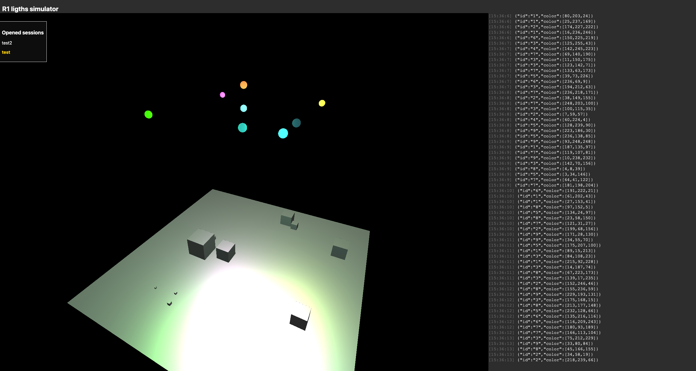

# Lights controller web service

## Local deploy

1. Create virtualenv ```virtualenv controllerEnv```
2. Activate virtualenv ```source <controllerEnv path>/bin/activate```
2. Install requirements ```pip install -r requirements.txt```
3. Launch app ```./run_dev.sh```, by default it will run on ```localhost:8000```



## Simulator views
- Home page: ```http://localhost:8000```
    - This page starts a new session room, called "main"
- Light simulator room view: ```http://localhost:8000/dashboard/<session_name>```
    - Isolated view for room session
- Help page: ```http://localhost:8000/help```
    - Shows API entrypoints and json schemas for lights controller

## Environment variables

To specify host Ip and Port you must set them as environment variables like:
```bash

export APP_PORT=9000
export APP_HOST=0.0.0.0
export APP_DEBUG=True

python src/server.py

```


## Controller switch
To switch between web application lights simulator and real pi controller you must set an environment variable ```export LIGHT_CONTROLLER=simulator``` or ```export LIGHT_CONTROLLER=controller```

## Command API
We process two REST endpoints with POST method data:

- ```setcolor``` illuminates one light based on id for an specific session. Json schema: 
```json

{"required": ["id", "color", "session"],
    "properties": {
        "id": { "type": "string" },
        "session": {"type": "string"},
        "color": { "type": "array", "items": { "type": "number", "minimum": 0,
  "maximum": 255} },
    }

```

- ```setbulk``` illuminates lights collection based on id for an specific session. Json schema: 

```json

{
    "required": ["set", "session"],
    "properties": {
        "session": {
            "type": "string"
        },
        "set": {
            "type": "array",
            "items": {
                "type": "object",
                "properties": {
                    "id": {
                        "type": "string"
                    },
                    "color": {
                        "type": "array",
                        "items": {
                            "type": "number",
                            "minimum": 0,
                            "maximum": 255
                        }
                    }
                }
            }
        }
    }
}

```

 
## Access simulator view
Simulator app works recieving and processing sent API commands through a websocket channel. Each simulator web app runs in an specific session_name, for example, ```http://localhost:8000/dashboard/test``` will process and draw all sent messages with ```test``` as session id. Opened sessions are shown in the home page of the simulator (```http://localhost:8000/```). Clicking a session name will show the session view.

### Pipeline

1. Send command to ```http://localhost:8000/setcolor``` with data ```{"id": "1", "color": [100, 200, 50], "session": "test"}```
2. In all browser tabs (opened in ```http://localhost:8000/dashboard/test```) you will see command logs and drawing simulation

## TODO

We are working on lights blueprint to put achieve the better representation of the real setup in R1. 