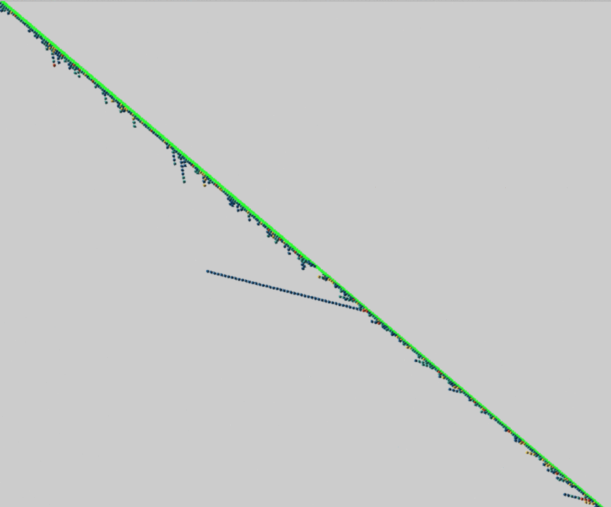
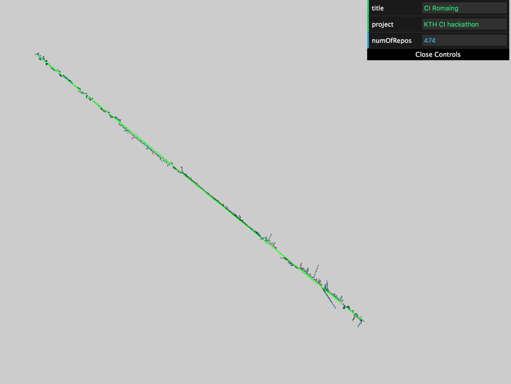
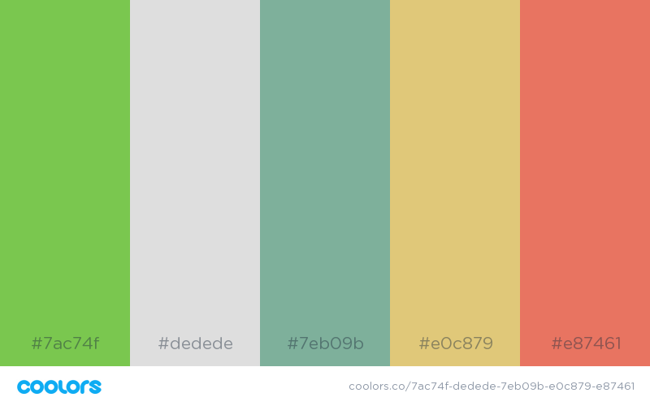

A roaming in the ci universe

## Description
The project is to present CI/CD build into 3D chains, where each repo will be added into the main chain and all new builds will be rotating around it. 
The color of the build cube will be changed based on the build state.

## Start project
```
yarn install && yarn build 
yarn start
```
Visit http://localhost:8080

## Product deploy
```
yarn build 
yarn install global serve
yarn serve -p 80 -s /dist
```

## Build docker image and start by docker
```
docker build -t roaming .
docker run -p 8080:8080 roaming
```
Visit http://localhost:8080

## Examples 


## Latest GUI screenshot 
* Add gui to show project, name and number of repos which has been received 


## Color palette
I'm using https://coolors.co to generate color palette in this project

