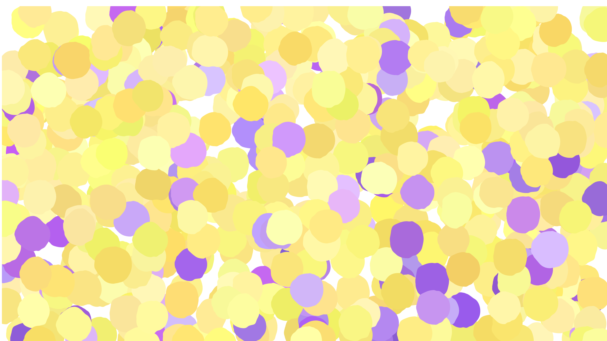

# The Gender of TravisCI
The Gender of TravisCI aims to highlight the lack of women in computer science.

This project (unfortunately) relies on normative assumptions because the stream doesn't provide information on the user's gender, and is also restricted to binary gender (non-binary and other genders should be represented too!). Therefore, it makes use of the first name of the user (for those who provide it) and searches through a database of common male/female names.

The visualization uses p5.js and paints a blob for each commit message in the TravisCI stream. Female as purple and male as yellow.

